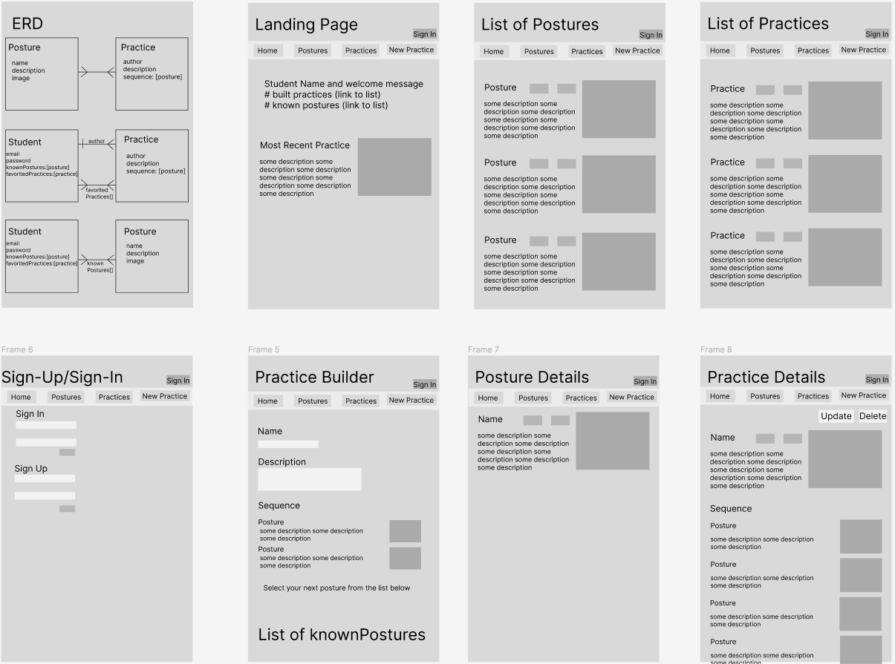

# Yoga Practice Builder

Collect postures that you know and use them to build a yoga sequence

## ERD & Wireframes

## User Stories
### MVP/Version 1
- As a user I want to be able to sign in
- As a user I want to be able to see a landing page with navigation buttons
- As a user I want to be able to see a list of all postures in the library
- As a user I want to be able to see a list of my known postures
- As a user I want to be able to select postures from the library to add to my list of known postures
- As a user I want to be able to see posture details
- As a user I want to be able to see a list of the practices I have built
- As a user I want to be able to see a list of all practices posted by all users
- As a user I want to be able to see the details of a practice
- As a user I want to be able to favorite a practice to try later
- As a user I want to be able to build a new practice
- As a user I want to be able to add postures to a sequence
- As a user I want to be able to update a practice I created
- As a user I want to be able to delete a practice I created

### Version 2
- As a user I want to be able to build a new practice from a list of templates
- As a user I want to be able to add new (unique) postures to the library
- As a user I want to be able to filter lists of practices by tags (find a practice to try)

### Version 3
- As a user I want a timed autoplay step through of the sequence
- As a user I want audio instuctions during playback